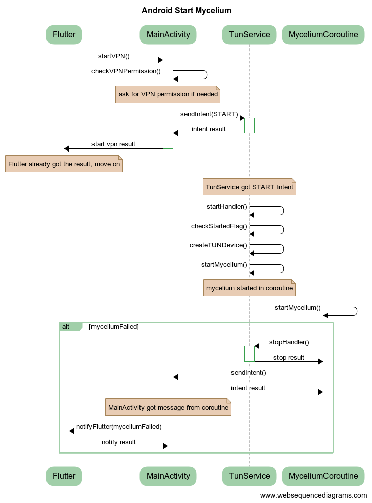
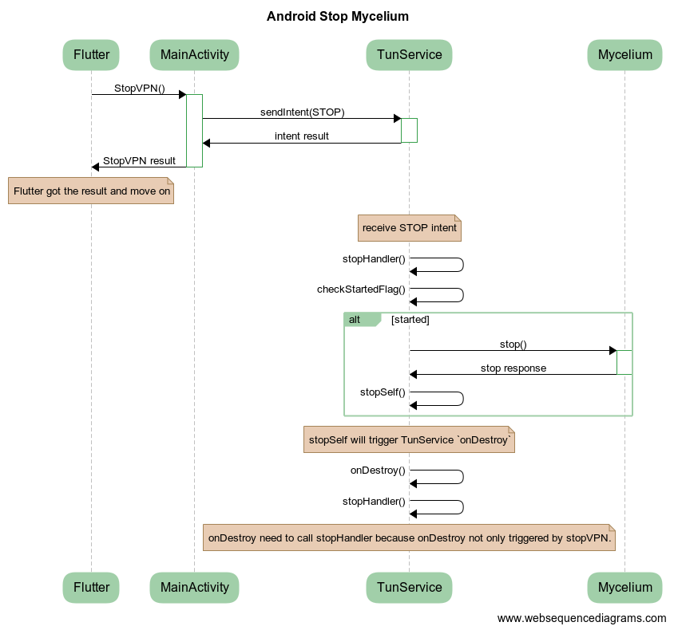

# Android specific docs

## Start Mycelium
websequencediagrams code
```plantuml
title Android Start Mycelium

Flutter->+MainActivity:startVPN()
    MainActivity->MainActivity:checkVPNPermission()
    note over MainActivity: ask for VPN permission if needed
    MainActivity->+TunService: sendIntent(START)
    TunService->-MainActivity: intent result
MainActivity->-Flutter:start vpn result

note over Flutter: Flutter already got the result, move on

note over TunService: TunService got START Intent
TunService->TunService: startHandler()
TunService->TunService: checkStartedFlag()
TunService->TunService: createTUNDevice()
TunService->TunService: startMycelium()
note over TunService: mycelium started in coroutine

MyceliumCoroutine->MyceliumCoroutine: startMycelium()
alt myceliumFailed
    MyceliumCoroutine->+TunService:stopHandler()
    TunService->-MyceliumCoroutine: stop result
    
    MyceliumCoroutine->+MainActivity: sendIntent()
    MainActivity->-MyceliumCoroutine: intent result
    
    note over MainActivity: MainActivity got message from coroutine
    MainActivity->+Flutter: notifyFlutter(myceliumFailed)
    Flutter->-MainActivity: notify result
end
```


## Stop Mycelium

websequencediagrams code
```plantuml
title Android Stop Mycelium

Flutter->+MainActivity: StopVPN()
    MainActivity->+TunService:sendIntent(STOP)
    TunService->-MainActivity: intent result
MainActivity->-Flutter: StopVPN result
note over Flutter: Flutter got the result and move on

note over TunService: receive STOP intent
TunService->TunService: stopHandler()
TunService->TunService: checkStartedFlag()
alt started
    TunService->+Mycelium: stop()
    Mycelium->-TunService: stop response
    TunService->TunService: stopSelf()
    TunService->MainActivity:sendIntent(myceliumFinished)
    MainActivity->Flutter:sendMessage(myceliumFinished)
    Flutter->Flutter:updateState()
end

note over TunService: stopSelf will trigger TunService `onDestroy`
TunService->TunService: onDestroy()
TunService->TunService:stopHandler()
note over TunService: onDestroy need to call stopHandler because onDestroy not only triggered by stopVPN.
```
